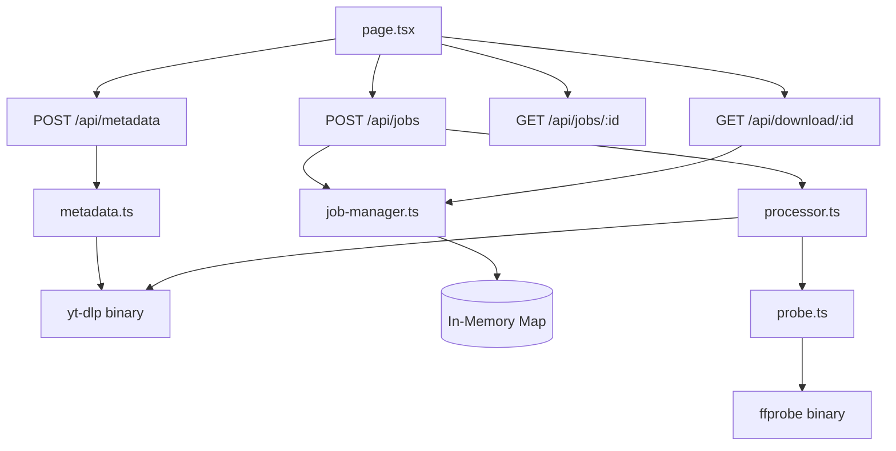

# Link2Media Smart Conversion — Baseline de Auditoría

Fecha: 2026-06-15

## Arquitectura actual



## Inventario de rutas API

| Método | Ruta | Descripción |
|--------|------|-------------|
| POST | /api/metadata | Extrae metadatos de URL de YouTube vía yt-dlp |
| POST | /api/jobs | Crea y lanza un trabajo de conversión |
| GET | /api/jobs/:id | Polling del estado del trabajo |
| GET | /api/download/:id | Descarga el artefacto con token |
| GET | /api/health | Estado de dependencias |

## Inventario de herramientas

- `yt-dlp`: descarga y conversión de YouTube (requerido)
- `ffmpeg`: procesamiento de audio/vídeo (requerido por yt-dlp)
- `ffprobe`: verificación del artefacto generado (requerido)

## Ciclo de vida de un job (actual)

```
queued → downloading → processing (implícito en yt-dlp) → verifying → completed | failed | cancelled
```

## Persistencia actual

**Ninguna.** El `JobManager` usa un `Map<string, Job>` en memoria:

- Jobs se pierden al reiniciar la aplicación.
- Sin historial entre sesiones.
- Sin recuperación tras cierre inesperado.

## Baseline de calidad

### Linting

```
pnpm lint → Sin errores conocidos
```

### TypeScript

```
pnpm typecheck → Sin errores conocidos
```

### Tests

- Vitest configurado con `--passWithNoTests` → **Cero tests reales** escritos.
- No hay fixtures de media.
- No hay tests de integración.
- No hay tests E2E.

### Build

- `pnpm build` → Funciona.
- Next.js standalone configurado.

### Portable Windows

- ZIP existente con Node portable, yt-dlp.exe, ffmpeg/ffprobe.exe.
- `--no-check-certificates` usado en yt-dlp (workaround SSL corporativo).
- Scripts BAT/PS1 para lanzar, cerrar y actualizar.

## Riesgos identificados

| Riesgo | Severidad | Descripción |
|--------|-----------|-------------|
| Sin persistencia | Alta | Historial y jobs se pierden al reiniciar |
| Sin tests | Alta | Sin cobertura — regresiones invisibles |
| Solo YouTube | Media | Sin soporte de archivos locales |
| Solo MP3/MP4 | Media | Limitación de formatos de salida |
| `path.startsWith()` en path-safety | Media | Susceptible a path traversal en algunos OS |
| `--passWithNoTests` | Media | Oculta ausencia de tests en CI |
| Sin historial de UI | Baja | El usuario no puede ver conversiones anteriores |
| Sin diagnóstico visible | Baja | Sin pantalla de estado de herramientas |

## Decisiones propuestas

1. **SQLite con `better-sqlite3`** para persistencia sincrónica, compatible con Next.js standalone y Windows portable.
2. **Capacidad engine determinista** basada en ffprobe + matriz de reglas tipadas.
3. **Upload local con streaming multipart** — no cargar archivo completo en RAM.
4. **Formatos expandidos**: MP3, M4A, WAV, FLAC, OGG, MP4, WebM, MKV.
5. **UI mobile-first con navegación por secciones**: Convertir / Historial / Diagnóstico.
6. **Path safety con `path.relative()` + realpath** para prevenir traversal.
7. **Tokens de un solo uso** con hash guardado en SQLite.

## Alcance explícito de esta implementación

### Incluido

- SQLite (persistencia y historial).
- Upload de archivos locales.
- Análisis técnico con ffprobe.
- Motor de compatibilidad.
- Formatos: MP3, M4A, WAV, FLAC, OGG, MP4, WebM, MKV.
- Recorte (trim).
- Normalización de audio.
- GIF (tramos cortos).
- Thumbnails y frames.
- Subtítulos (extracción básica).
- Historia con filtros.
- Diagnóstico de herramientas.
- UI mobile-first renovada.
- Windows portable actualizado.

### Excluido

- PWA / Service Worker.
- Acceso LAN.
- Electron / Tauri / React Native.
- Redis / BullMQ.
- Transcripción (Whisper).
- Conversión de imágenes como módulo principal.
- Conversión de documentos (Pandoc/PDF).
- AV1 / H.265 como opción por defecto.
